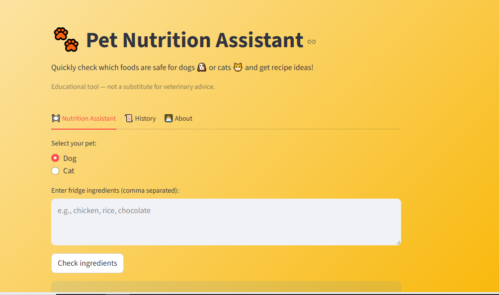
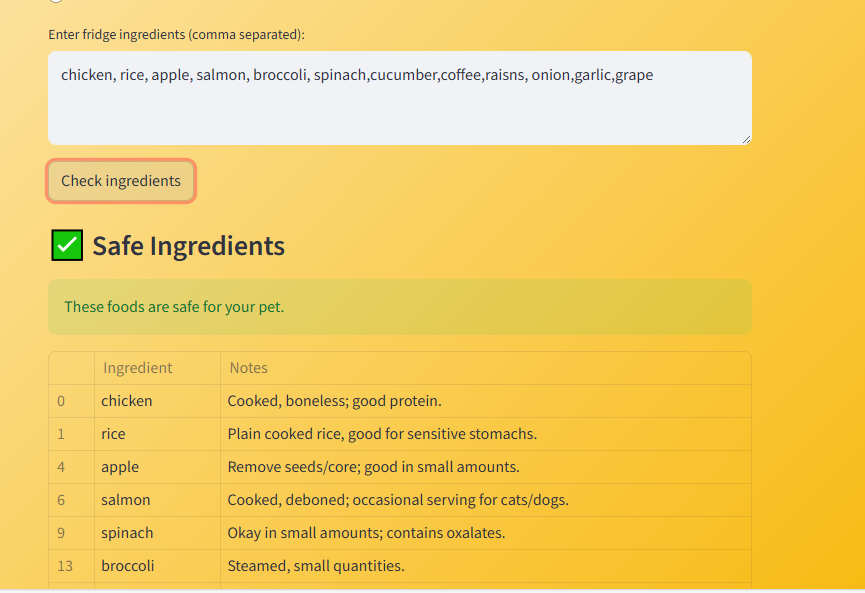
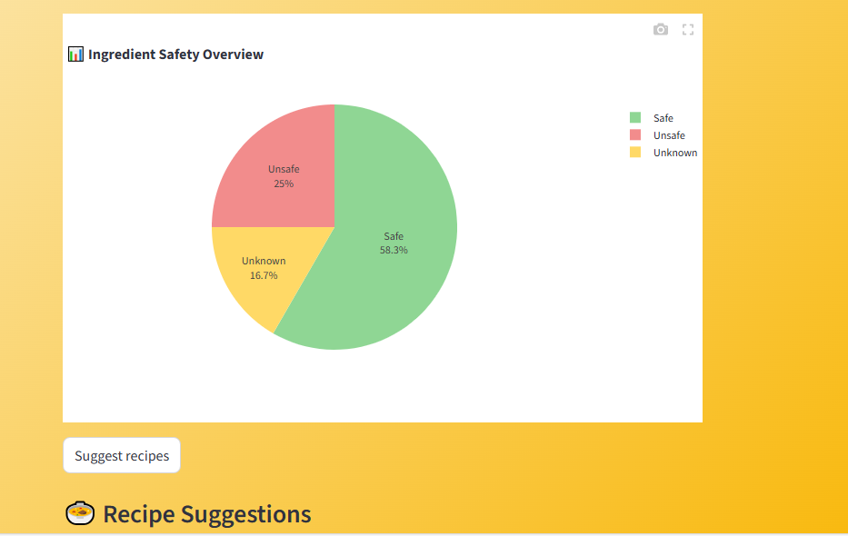
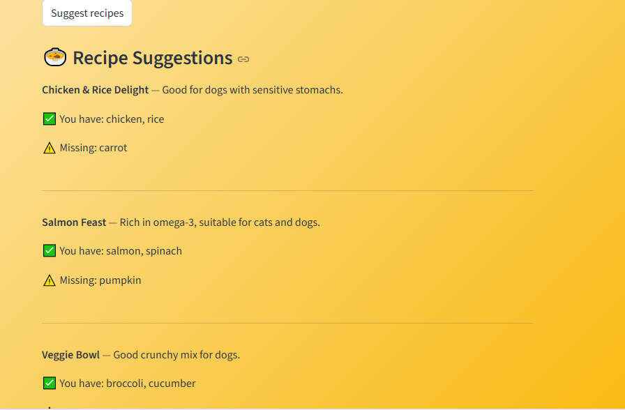
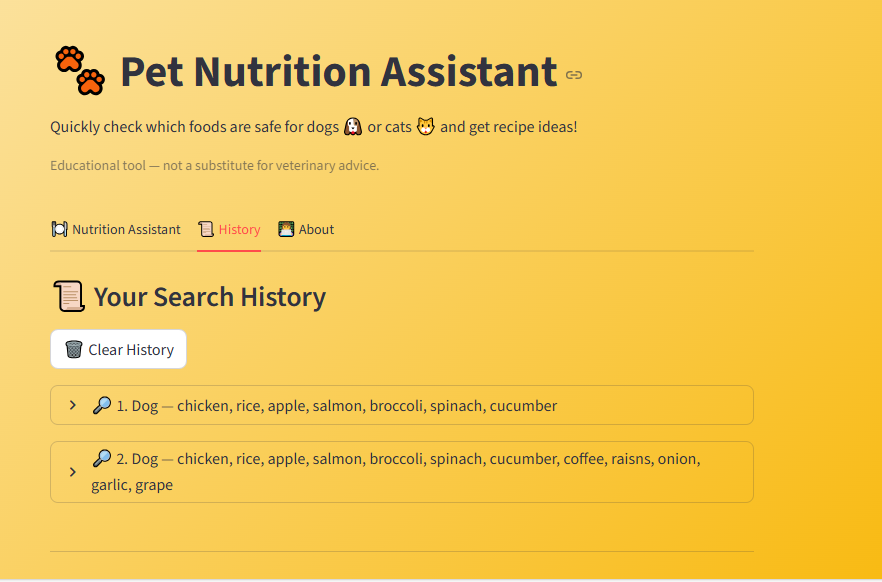
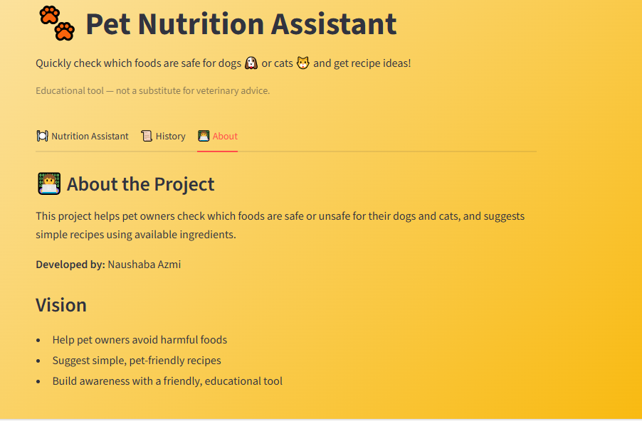

# 🐾 Pet Nutrition Assistant

An interactive Streamlit web app to help pet owners quickly check which foods are safe for their dogs 🐶 or cats 🐱 and get simple healthy recipe suggestions using available ingredients. 

**Educational tool - not a substitute for veterinary advice.**

---

## 🚀 Features
- ✅ Check if foods are safe or unsafe for pets
- 🍲 Suggest pet-friendly recipes based on fridge ingredients
- 📊 Visualize results with pie charts showing ingredient safety breakdown
- 📜 Keep a history of your checks
- 👩‍💻 Simple, beginner-friendly Python + Streamlit project

---

## 📸 Screenshots
### Homepage


### Safe Ingredients


### Pie Chart Overview


### Recipe Suggestions


### History


### About


---

## ⚙️ Installation

Clone this repo and install requirements:

```bash
git clone https://github.com/AzZinu/pet-nutrition-assistant.git
cd pet-nutrition-assistant
pip install -r requirements.txt
```
## ▶️ Run the App
```
streamlit run app.py
```
## 📂 Project Structure

```plaintext
pet-nutrition-assistant/
├─ data/
│   ├─ foods.csv
│   └─ recipes.csv
├─ screenshots/
│   ├─ homepage.PNG
│   ├─ safe.PNG
│   ├─ pie.PNG
│   ├─ recipe.PNG
│   ├─ history.PNG
│   └─ about.PNG
├─ app.py
├─ README.md
├─ .gitignore
├─ requirements.txt
```
## 👩‍💻 Developer

Naushaba Azmi

Made with ❤️ at Animal Hack 2025

